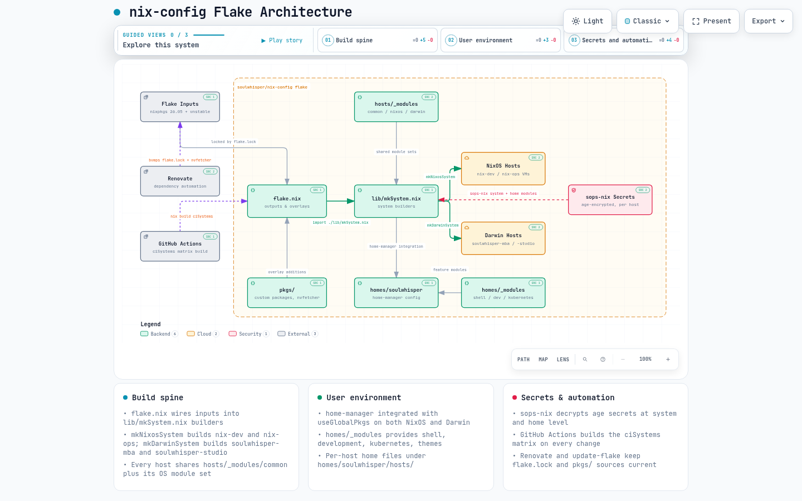

# Architecture

Interactive map of how this flake is wired: `flake.nix` inputs and outputs,
the `lib/mkSystem.nix` builders, shared host/home module sets, the four host
configurations, secrets, and automation.

- [Interactive diagram](_assets/architecture.html) — pan/zoom, search, and
  per-node source links pinned to a pinned `main` revision. Open locally in a
  browser; GitHub does not render standalone HTML.
- [architecture.json](_assets/architecture.json) — source specification used
  to regenerate the diagram.

## Regenerate

The diagram is authored with the local `archify` skill. To refresh after
structural changes, update `docs/_assets/architecture.json` (node `sources`
must point at real files, and `meta.repository.revision` must be the current
`main` HEAD), then re-run validate/deliver per the skill's workflow.
